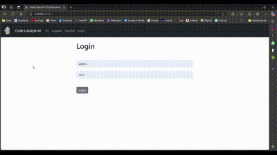
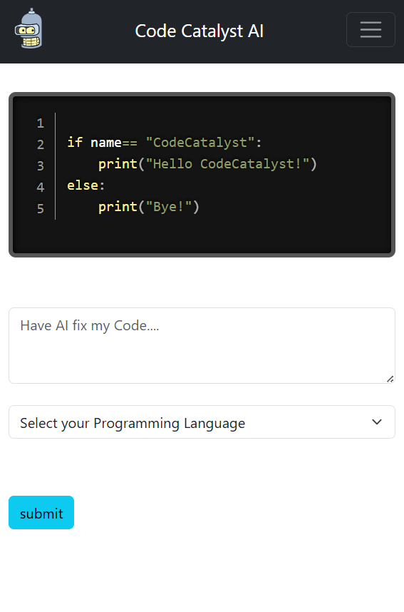
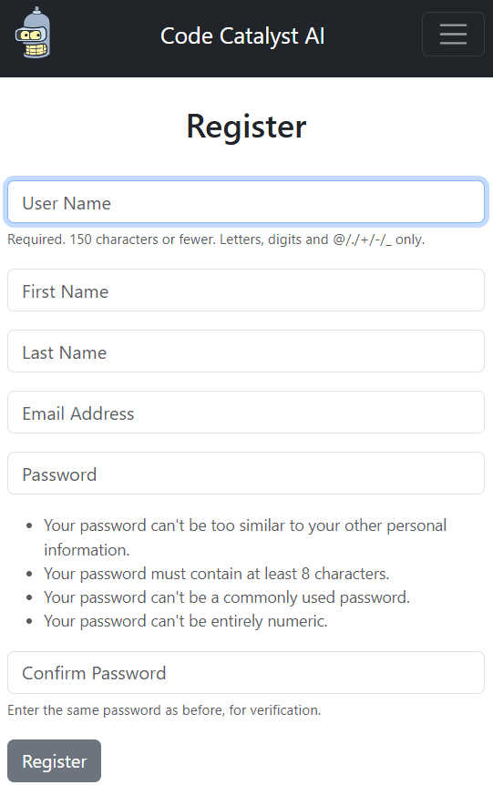

<!--  -->
<div align="center">

</div>

## CodeCatalystAI is a Django based web application that uses AI to fix and write code.

## Features :

- Fix Code.
- Code Completion/ Code Generation.
- This project uses Gemini to generate & fix code.

## Live at - "NOT DEPLOYED YET 😢"

## Preview:-



- Mobile Device :-

  
  

## Run Locally:-

#### Clone the project

```bash
  git clone "https://github.com/Dev7083/CodeCatalystAI.git"
```

#### Go to the project directory

```bash
  cd CodeCatalystAI
```

### Create Virtual Environment & Activate Virtual Environment

- Install Virtualenv:

  ```bash
  pip install virtualenv
  ```

- Create virtual environment:

  ```
  virtualenv env
  ```

- In Command Prompt:

  ```cmd
  cd env
  Scripts/activate
  ```

- In Bash/Linux:

  ```bash
  source env/Scripts/activate
  ```

### Install Required Modules from requirements.txt file

```bash
pip install -r "requirements.txt"
```

### Update GOOGLE GEMINI API KEY in a ".env" file in "codebot" folder.

- Sample env file is ".env.sample"

  ```
  GOOGLE_GENERATIVE_AI_API_KEY="YOUR_API_KEY"
  ```

## Start the Server 🖥️:

- from the root folder

```bash
python manage.py runserver
```

## Tech Stack:

- **Framework:** Django
- **UI:** Bootstrap
- **Syntax Highlighting:** Prism JS
- **Database:** Django default Sqlite3
- **GenAI:** GenerativeAI from Google

---

## Project Tree:

```
CodeCatalyst AI
├─ codebot
│  ├─ .env
│  ├─ asgi.py
│  ├─ settings.py
│  ├─ urls.py
│  ├─ wsgi.py
│  ├─ __init__.py
├─ db.sqlite3
├─ manage.py
├─ README.md
├─ requirements.txt
└─ website
   ├─ admin.py
   ├─ apps.py
   ├─ forms.py
   ├─ migrations
   │  ├─ 0001_initial.py
   │  ├─ __init__.py
   ├─ models.py
   ├─ static
   │  ├─ css
   │  │  └─ prism.css
   │  ├─ img
   │  │  └─ final_logo_for_codebot.svg
   │  └─ js
   │     └─ prism.js
   ├─ templates
   │  ├─ base.html
   │  ├─ history.html
   │  ├─ home.html
   │  ├─ navbar.html
   │  ├─ register.html
   │  └─ suggest.html
   ├─ tests.py
   ├─ urls.py
   ├─ views.py
   ├─ __init__.py

```
